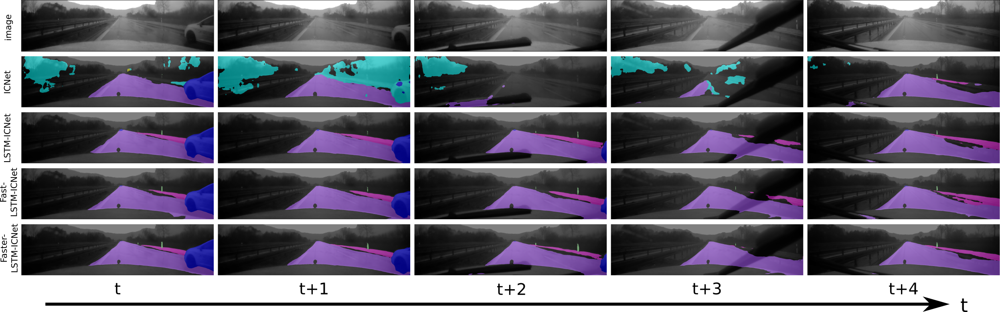

# LSTM-ICNet

This repo provides the tensorflow implementation of the papers "[Semantic Segmentation of Video Sequences with Convolutional LSTMs](https://arxiv.org/pdf/1905.01058.pdf)", "[Separable Convolutional LSTMs for Faster Video Segmentation](https://arxiv.org/pdf/1907.06876.pdf)" and "[Robust Semantic Segmentation in Adverse Weather Conditions by means of Fast Video-Sequence Segmentation](https://arxiv.org/pdf/2007.00290.pdf)" by Andreas Pfeuffer, et. al.

**Example: Video sequence at heavy rain** (image from [1])



## Requirements

This code was tested on Ubuntu 18.04 using Tensorflow 1.14 and python 2. Furthermore, we provide a virtual environment for testing.

The following compoents are required for this repository:

* git
* git-lfs
* singularity (tested on version 2.5.2-dist) - For more information about installation and usage see [here](https://sylabs.io/guides/3.0/user-guide/index.html)

### Setup

* clone Repository
 
    ```
    $ git clone https://github.com/Andreas-Pfeuffer/LSTM-ICNet.git
    $ cd LSTM-ICNet
    $ git-lfs pull
    ```
    
* Build singularity container

    ```
    $ cd singularity
    $ sudo singularity build ubuntu1804_tensorflow1.14_cuda10.simg ubuntu1804_tensorflow1.14_cuda10.def
    ```

### Datasets

* Download [Cityscapes](https://www.cityscapes-dataset.com/) and [virtual Kitti](https://europe.naverlabs.com/research/computer-vision/proxy-virtual-worlds-vkitti-1/)

* for single-image segmentation approaches, create a txt-file for each subset (train/val/test) according to

    ```
    <path2folder>/image_1.png <path2folder>/gt_1.png 
    <path2folder>/image_2.png <path2folder>/gt_2.png 
    ```
    
* for video segmentation approaches (sequence_length = 4), create a txt-file for each subset (train/val/test) according to

    ```
    <path2folder>/image_seq1_1.png <path2folder>/gt_seq1_1.png 
    <path2folder>/image_seq1_2.png <path2folder>/gt_seq1_2.png 
    <path2folder>/image_seq1_3.png <path2folder>/gt_seq1_3.png 
    <path2folder>/image_seq1_4.png <path2folder>/gt_seq1_4.png
    <path2folder>/image_seq2_1.png <path2folder>/gt_seq2_1.png 
    <path2folder>/image_seq2_2.png <path2folder>/gt_seq2_2.png 
    <path2folder>/image_seq2_3.png <path2folder>/gt_seq2_3.png 
    <path2folder>/image_seq2_4.png <path2folder>/gt_seq2_4.png
    ```
    
* Adapt pathes in *src/config.py*

    ```
    line 18: default_data_dir = '<path2folder>/datasets'
    ```
    
* modify pathes to the corresponding image-lists in *src/datasets/cityscapes.py* and *src/datasets/virtual_kitti.py*


## Getting Started

### Training

Apply script in terminal for training:

    $ sh scripts/train_LSTM_ICNet.sh         # for LSTM-ICNet
    $ sh scripts/train_Fast_LSTM_ICNet.sh    # for Fast-LSTM-ICNet
    $ sh scripts/train_Faster_LSTM_ICNet.sh  # for Faster-LSTM-ICNet
    
* Note, a GPU with at least 11GB memory is required for training (e.g Nvidia GeForce GTX 1080Ti)

* enables multi-GPU training!

### Evaluation

Apply script in terminal

    $ sh scripts/eval_LSTM_ICNet.sh         # for LSTM-ICNet
    $ sh scripts/eval_Fast_LSTM_ICNet.sh    # for Fast-LSTM-ICNet
    $ sh scripts/eval_Faster_LSTM_ICNet.sh  # for Faster-LSTM-ICNet

### Inference

Apply script in terminal

    $ sh scripts/inference_LSTM_ICNet.sh         # for LSTM-ICNet
    $ sh scripts/inference_Fast_LSTM_ICNet.sh    # for Fast-LSTM-ICNet
    $ sh scripts/inference_Faster_LSTM_ICNet.sh  # for Faster-LSTM-ICNet 
    
* the images are stored in the output folder!

* create TensorRT model, if *config.FREEZEINFERENCEGRAPH.MODE = True*
    
## (Pretrained) Weights

* Converted pretrained weights of [ICNet](https://github.com/hellochick/ICNet-tensorflow) for Cityscapes can be found in *pretrained_models*

* LSTM-ICNet, Fast-LSTM-ICNet and Faster-LSTM-ICNet weights can be found in *results* (trained with batch-size = 1)

| network architecture | accuracy | mIoU |
| ------ | ------ | ------ |
| LSTM-ICNet-v5 | 93.17 | 62.62 |
| Fast-LSTM-ICNet-v5 | 92.92 | 62.04 |
| Faster-LSTM-ICNet-v5 | 92.73 | 60.24 |

## Citation

If you use this code, please cite the following papers:

    @article{Pfeuffer2019SemanticSO,
        title={Semantic Segmentation of Video Sequences with Convolutional LSTMs},
        author={Andreas Pfeuffer and Karina Schulz and Klaus Dietmayer},
        journal={2019 IEEE Intelligent Vehicles Symposium (IV)},
        year={2019},
        pages={1441-1447}
    }
    
    @INPROCEEDINGS{pfeuffer2019separable
        title={Separable Convolutional LSTMs for Faster Video Segmentation}, 
        author={Andreas {Pfeuffer} and Klaus {Dietmayer}},
        booktitle={2019 IEEE Intelligent Transportation Systems Conference (ITSC)}, 
        year={2019},
        volume={},
        number={},
        pages={1072-1078},
    }

    @INPROCEEDINGS{pfeuffer2020robust
        title={Robust Semantic Segmentation in Adverse Weather Conditions by means of Fast Video-Sequence Segmentation}, 
        author={Andreas {Pfeuffer} and Klaus {Dietmayer}},
        booktitle={2020 IEEE Intelligent Transportation Systems Conference (ITSC)}, 
        year={2020},
        volume={},
        number={},
        pages={},
    }

  
  ## References
  
  [1] Pfeuffer, A. et al; "Robust Semantic Segmentation in Adverse Weather Conditions by means of Fast Video-Sequence Segmentation"; 2020 IEEE Intelligent Transportation Systems Conference (ITSC) 
    
